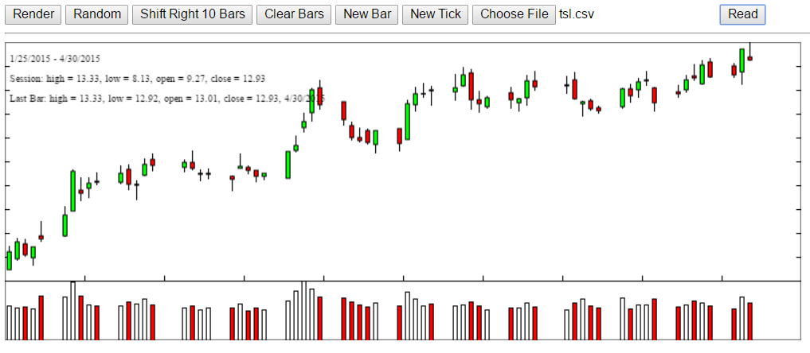

#  candlejs  

## Candlestick Charting for Time Series  
**candlejs** is used for charting real-time market data such as stock or future prices. It's light weight and high performance with no dependency on other packages. It's optimal for intra-day trading scenarios.

[](./LICENSE.txt)
[](https://www.npmjs.com/package/candlejs)
[](https://www.npmjs.com/package/candlejs)



## Installations
### Fork & Development
```
git clone https://github.com/rp8/candlejs.git
cd candlejs
npm install
```
### Use Only
```
npm install candlejs --save
```

## Dev & Test
1. npm run build
2. open test/candle.html in Chrome to test simple simulator & chart
3. open test/candle.html in Chrome to test more with tick data from files and simulator
4. npm run test

## Usages
```js
var cjs = require('candle');
```
### TickSeries - Tick time series
```js
var ticks = new cjs.TickSeries('AAPL');
ticks.on('changed', () => {
  ...
};
ticks.add(time, price, volume);
ticks.trimOldData(1000, 10000);
ticks.clear();
for var tick in ticks.data {
  ...
}
```
### Bars - Bar time series of intervals such as daily, hourly, 5 min, etc
```js
var dailyBars = new cjs.Bars('AAPL', 24*3600*1000);
dailyBars.add(time, open, high, low, close, volume);
dailyBars.addTick(tick);
dailyBars.addTicks(ticks);
dailyBars.on('changed', () => {
  ...
});
...
dailyBars.clear();
```
### Simulator - Simulating price time series
```js
var s = new cjs.Simulator(0.10, 100.00, 100);
s.onData((err, data) => {
  ...
});
s.start();
s.stop();
```
### CandleChart
```js
var chart = new cjs.CandleChart({candleWidth: 4});
var bars = new cjs.Bars('AAPL', 24*3600*1000);
chart.addSeries(bars);
chart.outputTo(canvas);
chart.render();
chart.setDisplayRange(openTime, closeTime);
...
chart will update with the streaming data coming from bars.
```
### LineReader - Reading data from a local file
```js
var lr = new cjs.LineReader();
var bars = new cjs.Bars('AAPL', 24*3600*1000);
bars.sort(function(a, b) {
  return a[0] - b[0];
});

var bars0 = [];
lr.on('end', function() {
  for (i = 0; i < bars0.length; i++) {
    var b = bars0[i];
    bars.add(b[0], b[1], b[2], b[3], b[4], b[5]);
  }
});

lr.on('line', function (line, next) {
  if (line.indexOf('Date') === -1) {
    var bar = line.split(',');
    bars0.push([
      new Date(bar[0]).getTime(),
      parseFloat(bar[1]), 
      parseFloat(bar[2]), 
      parseFloat(bar[3]), 
      parseFloat(bar[4]), 
      parseFloat(bar[5])
    ]);
  } 
  next();
});

lr.read($('file').files[0]);
```
### HTML
```html
<html>
<head>
  <script type="text/javascript" src="../dist/candle.min.js"></script>
</head>
<body>
  <button id="start">Start</button>
  <button id="stop">Stop</button>
  <hr>
  <canvas id="chart" width="800" height="300"></canvas>

  <script type="text/javascript">
    function $(name) {
      return document.getElementById(name);
    };

    var cjs = require('candle');

    var chart = new cjs.CandleChart({candleWidth: 4});
    chart.outputTo($('chart'));

    var bars = new cjs.Bars('TSL', 3600*24*1000);
    chart.addSeries(bars);

    var s = new cjs.Simulator(0.10, 99, 10);
    var openTime;
    s.onData((err, data) => {
      openTime += bars.interval/20;
      bars.addTick([openTime, data[1], data[2]]);
      chart.render();
    });

    $('start').addEventListener('click', function() {
      console.log('simulated price started...');
      bars.clear();
      openTime = new Date().getTime();
      s.start();
    });

    $('stop').addEventListener('click', function() {
      console.log('simulated price stopped...');
      s.stop();
    });

  </script>

</body>
</html>
```

## FAQ

## Issues

## Changelog
1/20/2019: 
1. added fixed to fix number of digits, default to 2
    var Simulator = function (vol, value, delay, fixed) {...}
2. added new mthod to draw horizontal lines
    CandleChart.prototype.addYLine = function(color, text, price) {..}
    
## License
*candlejs* is licensed under the [MIT License](https://opensource.org/licenses/MIT)
© 2015-2019 [Ronggen Pan](https://github.com/rp8)